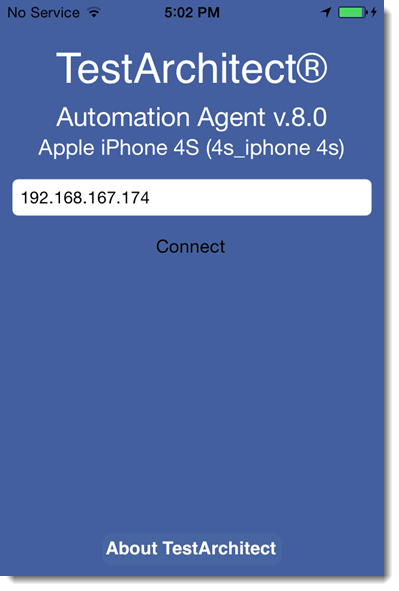

# Connecting to iOS TestArchitect Agent over Wi-Fi {#Installing_of_TA_on_target_device_iOS .task}

Establishing a connection between an iOS device and a host machine allows TestArchitect to communicate with iOS mobile applications.

**Important:** iOS automation is only supported on Windows or macOS hosts.

Ensure that you have installed [TestArchitect Agent on the iOS device](iOS_installing_TA_target_device.md) and that you know the IP address of the host machine.

Perform the following procedures to connect the iOS device to the host machine using a Wi-Fi connection:

1.  On the iOS device, enable Wi-Fi and connect to the host machine via Wi-Fi.

2.  On the iOS device, start the TestArchitect Agent.

3.  On the TestArchitect Agent logon screen, enter the host machine IP address and click **Connect**.

    

    **Warning:** If the connection to the host machine cannot be established, wait until the message Cannot connect to the host machine. Please check the connection between your device and the host machine appears \(after about a minute\), then try to connect to the host machine again.

If a connection to the host machine is made successfully, a Connected Successfully message appears on the iOS device.

**Note:** To disconnect the iOS device from the host machine, click the **Disconnect** button on the TestArchitect Agent logon screen.

**Parent topic:**[Setting up the iOS test environment](../../iOS/Topics/iOS_setting_up_the_test_enviroment.md)

**Previous topic:**[Configuring an iOS device](../../iOS/Topics/iOS_setting_up_installation_target_devices.md)

