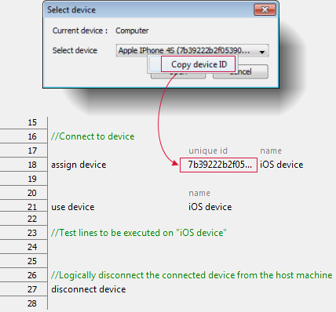
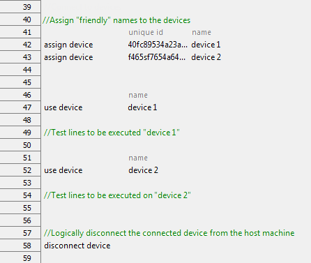

# Selecting target iOS devices during execution {#concept_pd2_1tn_n4 .concept}

From within your action lines, you can control which iOS device\(s\) your test is to execute on.

**Note:** Any device referenced by a use device action within a test must be connected to the same TestArchitect controller on which the test is running.

An example to indicate which iOS device to run automated tests on during runtime might look something like this:

The assign device action \(line 18\) assigns a logical or friendly name to a connected iOS device. The unique id argument represents an unique device identifier \(UDID\). To obtain UDID of an iOS device, refer to [assign device](../../TA_Automation/Topics/bia_assign_device.md).

The [use device](../../TA_Automation/Topics/bia_use_device.md) action \(line 21\) uses the logical name established in assign device to inform TestArchitect that the subsequent action lines are to be run on that device.

Finally, when testing on the new target device completes, it can be logically disconnected from the test host machine with [disconnect device](../../TA_Automation/Topics/bia_disconnect_device.md) \(line 50\). The subsequent action lines, if any, are run on the host machine.

## Running tests on multiple devices { .section}

The use device action allows automated tests to be run on different mobile devices. The devices must all be connected to the host controller on which the test is running, and execution across devices takes place in serial fashion. \(This is essentially the equivalent of [serial synchronous remote execution](../../reuse/../TA_Help/Topics/Test_exec_remote_synchronous_serial.md) for desktop application testing.\)

The above procedure begins with unique identifiers for two devices being assigned to friendly names. The use device action \(line 47\) commands a chunk of action lines to be executed on device 1. The second use device line \(line 52\) switches the current connection from device 1 to device 2, which also switches the execution domain, so that the subsequent chunk of action lines is run on device 2.

When test execution on all mobile devices is complete – or it is simply necessary to switch execution to the host controller for an interim task – a [disconnect device](../../reuse/../TA_Automation/Topics/bia_disconnect_device.md) is issued, which logically disconnects device 2 and allows for subsequent action lines to run on the host.

## Running 'use device' tests on devices connected to multiple controllers { .section}

Because each device has a unique ID, and those IDs are used to create the logical names \(via the assign device action\), if you want to execute a multiple device test on multiple controller/device clusters, your assign device actions must vary by cluster.

The following action lines can be employed for running a single test on multiple clusters. The test begins by querying the host machine to determine which controller the test is currently running on. By knowing the controller, it knows which devices are connected to it, and can assign those device IDs to logical names accordingly.

**Parent topic:**[Starting iOS automated tests](../../iOS/Topics/iOS_automated_tests_execution.md)

