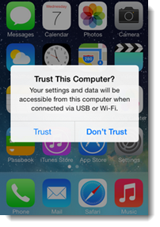

# Launching an AUT {#Launching_an_AUT_iOS .concept}

Approaches to launch a re-signed iOS application.

**Important:** iOS automation is only supported on Windows or macOS hosts.

There are two methods by which a re-signed iOS application may be launched:

-   One, the “real-world” method, is to simply tap the application's icon on the device.
-   Use the built-in action [start program](../../TA_Automation/Topics/bia_start_program.md).

## Preparing for automated testing on iOS {#section_pdh_mzj_m4 .section}

In order to ensure that the start program built-in action can successfully launch an application on an iOS device, carry out the following procedure:

1.  Synchronize essential development libraries with your iOS test device via Xcode:
    1.  Connect the iOS device to an macOS computer via USB cable.
    2.  You'll be asked to verify that you trust the connected computer. Tap **Trust**.

        

        Start Xcode on the macOS machine and wait for at least 10 seconds, so that the iOS device can obtain the essential development libraries.

        **Tip:** Once you see the device listed under the **Devices** heading in the panel on the left side of the Xcode application, you are assured that the transfer is complete.

2.  Install iTunes on the machine to be used as the test controller \(this may be a Windows or macOS machine\), ensuring that its version is compatible with the test device's iOS version.
3.  Ensure that your iOS device is recognized in iTunes:
    1.  If not already done, connect the iOS device to the test controller host \(Windows or macOS\) with a USB cable.
    2.  If asked, as before, to verify that you trust the connected computer: tap **Trust**.
    3.  Start iTunes on the test controller machine and ensure that your connected iOS device appears under **Devices** heading in iTunes.

        **Note:** Once your iOS device is recognized in iTunes, TestArchitect is also able to detect it.

4.  Connect your iOS device to [TestArchitect Agent](iOS_connecting_to_host_machine.md) over Wi-Fi so that TestArchitect is able to communicate with iOS applications.
5.  During your first the automated run from a given test controller, execution of the start program action may again trigger a Trust This Computer? message, requiring manual intervention. You can inhibit this from happening by run the TrustActivator script prior to the run. The script is found at the following locations:
    -   Windows: TA\_INSTALL\_DIR\\device\\iOS\\tools\\, double-click the TrustActivator.bat file.
    -   macOS: Applications/TestArchitect/device/iOS/tools/, execute the TrustActivator.sh shell script via the terminal.

**Note:**

-   TrustActivator need only be run prior to the first test run \(from each given controller\). It is not necessary at all if you are “babysitting” the machine and free to respond to the Trust message yourself.
-   After successfully launching an application on the mobile device, you may unplug the USB cable from the test controller machine, as long as the [Wi-Fi connection](iOS_connecting_to_host_machine.md) is maintained.

**Parent topic:**[iOS Automation](../../iOS/Topics/iOS_automation_def.md)

**Previous topic:**[Capturing iOS controls with the Interface Viewer](../../iOS/Topics/iOS_capturing_interface.md)

**Next topic:**[Starting iOS automated tests](../../iOS/Topics/iOS_automated_tests_execution.md)

